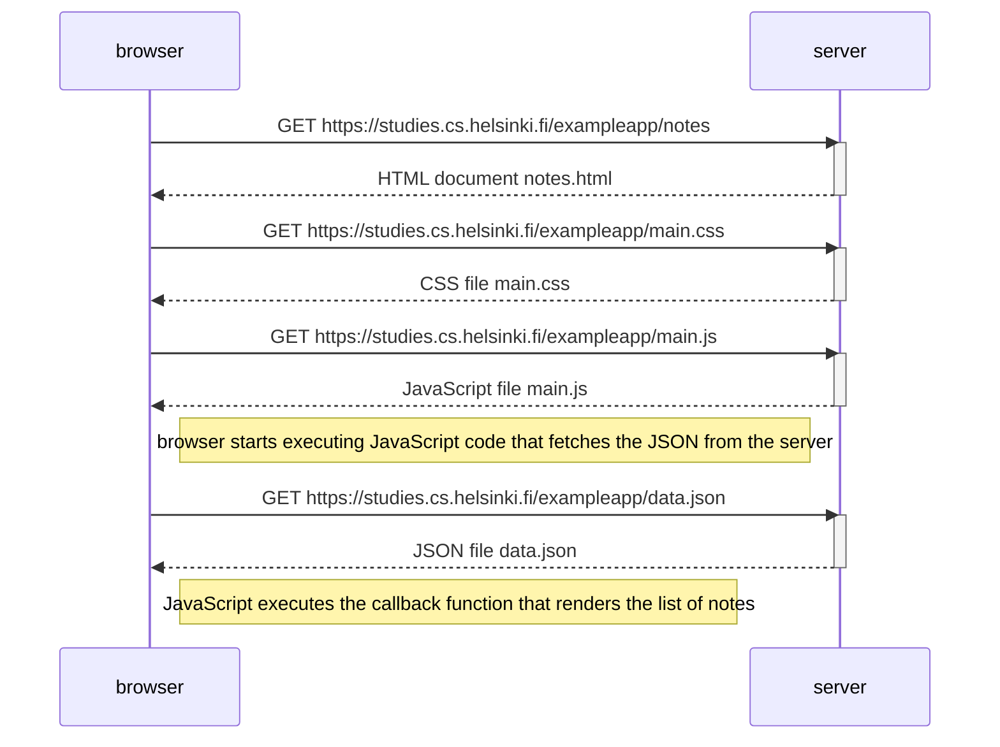

```mermaid
sequenceDiagram
participant browser
participant server

browser->>server: GET https://studies.cs.helsinki.fi/exampleapp/notes
activate server
server-->>browser: HTML document notes.html
deactivate server

browser->>server: GET https://studies.cs.helsinki.fi/exampleapp/main.css
activate server
server-->>browser: CSS file main.css
deactivate server

browser->>server: GET https://studies.cs.helsinki.fi/exampleapp/main.js
activate server
server-->>browser: JavaScript file main.js
deactivate server

Note right of browser: browser starts executing JavaScript code that fetches the JSON from the server

browser->>server: GET https://studies.cs.helsinki.fi/exampleapp/data.json
activate server
server-->>browser: JSON file data.json
deactivate server

Note right of browser: JavaScript executes the callback function that renders the list of notes

```
