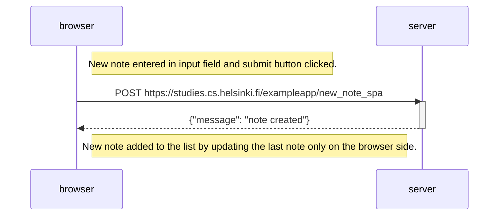

```mermaid
sequenceDiagram
participant browser
participant server

Note right of browser: New note entered in input field and submit button clicked.

browser->>server: POST https://studies.cs.helsinki.fi/exampleapp/new_note_spa
activate server
server-->>browser: {"message": "note created"}
deactivate server

Note right of browser: New note added to the list by updating the last note only on the browser side.

```
