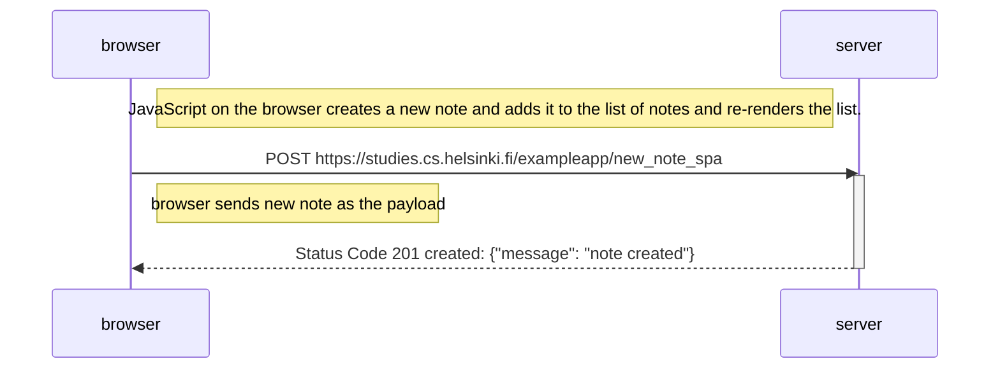

```mermaid
sequenceDiagram
participant browser
participant server

Note right of browser: JavaScript on the browser creates a new note and adds it to the list of notes and re-renders the list.
browser->>server: POST https://studies.cs.helsinki.fi/exampleapp/new_note_spa
activate server
Note right of browser: browser sends new note as the payload
server-->>browser: Status Code 201 created: {"message": "note created"}
deactivate server


```
